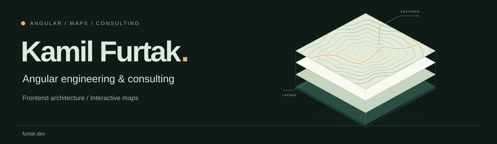

<picture>
  <source media="(prefers-color-scheme: dark)" srcset="assets/profile-banner-dark.svg">
  <source media="(prefers-color-scheme: light)" srcset="assets/profile-banner-light.svg">
  
</picture>

**Senior Angular Engineer · Frontend Architecture**

I’m a hands-on Angular engineer focused on complex business applications, reusable UI
and incremental modernization. I design and implement interfaces, application state and
integrations, with responsibility for code quality and delivery.

My independent projects apply the same Angular foundations in two different contexts:

- **[ClearCraft Workbench](https://clearcraft.dev/work/workbench/)** — visual and AI-assisted form authoring,
  human-reviewed proposals and document preparation. Purchase Request demonstrates the workflow
  on shared Angular controls, with local persistence and a model gateway.
- **[GeoAtlas](https://clearcraft.dev/work/geoatlas/)** — spatial data integrations,
  attribute tables, editing and map workflows for Poland.
- **[Shared UI](https://clearcraft.dev/work/reusable-ui/)** — grid, field, button and chat
  components used by both applications, with product rules kept in their own adapters.
- **[How I work](https://clearcraft.dev/how-i-work/)** — scoped implementation, code
  review, automated checks and documented release decisions.

**Stack** · Angular · TypeScript · RxJS · Nx · Vitest · Playwright · OpenLayers

I’m interested in hands-on **Senior Angular Engineer** roles and focused project work.
[For employers](https://clearcraft.dev/hire-me/#teams) ·
[Project collaboration](https://clearcraft.dev/hire-me/#projects) ·
[contact@clearcraft.dev](mailto:contact@clearcraft.dev)
