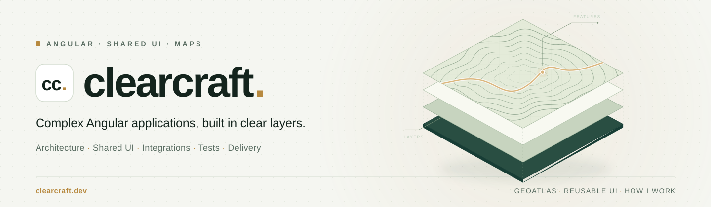

<picture>
  <source media="(prefers-color-scheme: dark)" srcset="assets/profile-banner-dark.svg">
  <source media="(prefers-color-scheme: light)" srcset="assets/profile-banner-light.svg">
  
</picture>

**Angular engineering & consulting · Frontend architecture · Interactive maps**

I help teams design, modernize and deliver complex Angular applications — from
project architecture and reusable libraries to data-heavy interfaces and map-based
workflows. I bring **13 years in enterprise web development and 9+ years with Angular**,
including GIS, cartography, document management and public-sector systems.

**Available for commercial consulting, implementation and team support.**
We can start with a focused review, one integration problem or a specific feature,
and agree on the scope together. You work directly with me.

[Discuss your project](mailto:kamil@furtak.dev) · [Services & experience](https://furtak.dev/) · [Live map demos](https://ng-openlayers.furtak.dev/) · [LinkedIn](https://linkedin.com/in/kamilfurtak)

## How I can help

- **Angular and frontend architecture:** organize growing projects and Nx workspaces,
  define application boundaries, and design reusable components and libraries.
- **Modernization and performance:** plan Angular migrations, improve complex interfaces,
  investigate performance issues and preserve established workflows during changes.
- **Maps and geospatial applications:** integrate OpenLayers with Angular and your data;
  build layers, projections, drawing, editing, selection and measurement workflows.
- **Implementation and team support:** hands-on development, code reviews, mentoring,
  pair programming and help with technical decisions throughout delivery.

**Core toolkit:** Angular, TypeScript, RxJS, Signals, Nx and OpenLayers.

## ng-openlayers — maps, the Angular way

I develop and maintain **ng-openlayers**, a library of declarative OpenLayers components
for Angular. Maps, views, layers, sources, styles, controls and interactions are composed
in templates with typed inputs and events.

The public demo includes **27 interactive examples**. Explore drawing and editing,
map data sources, projections and measurement, then bring your use case to a conversation.

**For commercial library access, licensing and implementation support, contact me directly.**
I can help with adopting the library, integrating it into a larger Angular application
and working through the mapping requirements of your product.

[Product & support](https://furtak.dev/projects/ng-openlayers/) · [Explore the live demo](https://ng-openlayers.furtak.dev/) · [Try drawing on a map](https://ng-openlayers.furtak.dev/examples/draw-polygon/) · [Engineering notes](engineering-notes.md)

## Experience

**13 years** of building enterprise web applications, **9+ years** with Angular — from jQuery and Knockout to Nx monorepos and signals.

#### 2022 – present · Senior Angular Engineer / Frontend Architecture

Angular frontend architecture for GIS, geodesy and cartography, document-management and public-sector systems.

- Nx monorepos, shared Angular libraries and reusable UI components for domain-heavy workflows.
- Migration of legacy Kendo/jQuery portals to Angular, with new interfaces working alongside established workflows.
- OpenLayers map features: spatial object interaction, sketching and editing.
- Nx generators and development automation; code review, integration debugging and automated tests.

#### 2020 – 2022 · Senior Angular Frontend Developer

Angular SPAs with modular routing, shared components and typed REST integrations. Improved structure and performance with lazy loading, AOT builds and change-detection strategies. Kendo UI and Angular Material forms with Jasmine, Karma and Cypress regression testing.

#### 2017 – 2019 · Angular Frontend Developer

Reusable components, services, routing and route guards for business and geospatial workflows. Code reviews, CI/CD and automated testing for maintainable, reliable releases.

#### 2013 – 2016 · Full-stack JavaScript Developer

JavaScript, jQuery, Knockout and Kendo UI on PHP/Symfony and Java backends with REST APIs and Oracle SQL.

**Education & languages:** MSc, AGH University of Science and Technology · postgraduate diploma in Java web development · Polish (native), English (B2, working proficiency).

## Skills

| Area | Skills |
| --- | --- |
| **Angular & TypeScript** | Angular (signals, RxJS), reusable component APIs and libraries, lazy loading, change-detection strategies, Kendo UI, PrimeNG, Angular Material, Formly |
| **Advanced interfaces** | Data-heavy workbenches, editors, dialogs and multi-step forms; state ownership, keyboard and accessibility behavior, workflows that survive UI changes |
| **GIS & web mapping** | OpenLayers; OSM, XYZ, WMS, WMTS, ArcGIS and GeoJSON sources; map projections and coordinate transformation (Proj4); drawing, editing, snapping, selection and measurement |
| **Architecture & delivery** | Nx monorepos and generators, incremental UI modernization, CI/CD, Git, Docker, Linux, AI-assisted workflows (MCP) |
| **Testing & quality** | Jasmine, Karma, Cypress, Playwright, axe accessibility checks, package-consumer validation, code review |
| **Backend & integration** | REST, OpenAPI, Java/Spring, C#/.NET, NestJS/Node.js, PHP/Symfony, SAML, SOAP/WSDL, SQL |

## Open-source contributions

I also contribute to open-source projects. Selected changes accepted by other maintainers:

- **[bolt.diy #1322](https://github.com/stackblitz-labs/bolt.diy/pull/1322)** — added model search and keyboard navigation to the model selector, including focus handling and filtering.
- **[Hindsight #3656](https://github.com/vectorize-io/hindsight/pull/3656)** — fixed disagreement between schema generation and the batch retain configuration; added regression tests for both conflicting settings.

## How I work

I clarify the problem and agree on a practical scope before implementation. I keep
feature state separate from rendering, define resource ownership and verify behavior
with automated tests. I explain the decisions and help the team take ownership of
the result.

AI tools support my implementation work; design decisions, source review and verification
remain my responsibility.

Building an Angular product or adding interactive maps? [Email me](mailto:kamil@furtak.dev)
with a short description of your application and the help you need, or visit
[furtak.dev](https://furtak.dev/) to explore my services.
